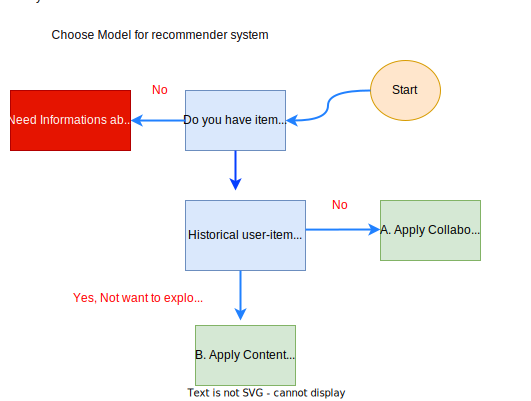

# Recommender System
###  Quick Start

 It is **recommanded** to run all the code in **Google Colab**.Please click on the following link.
 | Question  | Link  |Colab|
| --- | ----------- | ----------- | 
|Choose model for Recommender System | [NoteBook](https://github.com/csekankan/MTP-Recommender/blob/main/colab/Recommender_system_Model_Selection.ipynb) | |

### Flowchart to select right model

